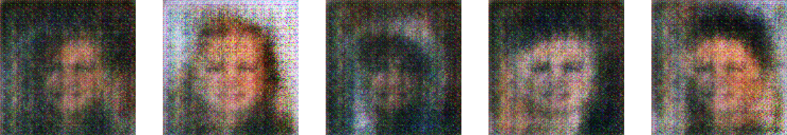
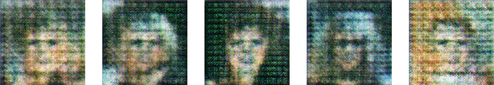
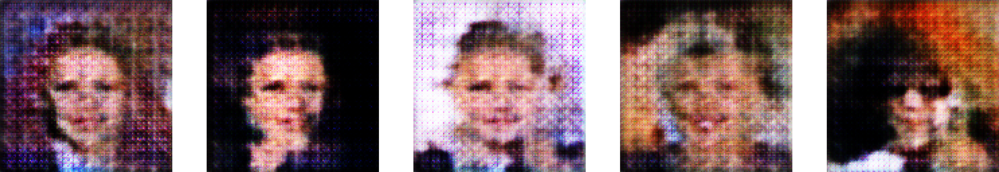
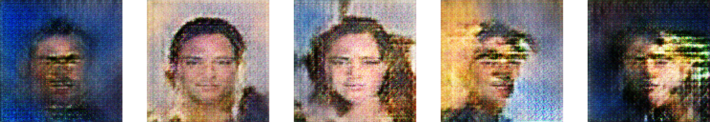
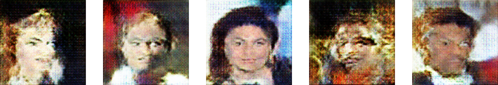
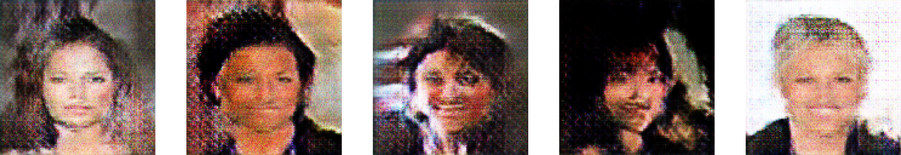
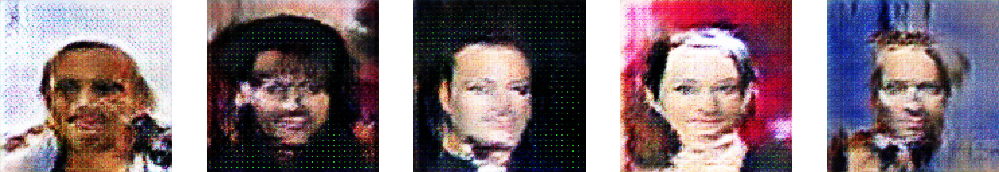
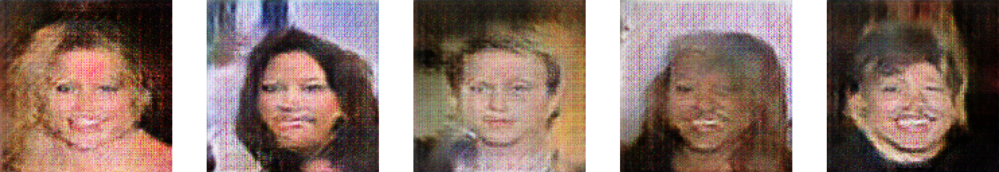

# deep_surfer_native
This is a showcase of neural networks for image classification, text generation, image generation, music generation, deep dream image manipulation, and teaching AI agents to act in video game environments using reinforcement techniques. This is a very large wrapper for lots of powerful cutting edge algorithms that I did not invent! Rather than restricting usage of these powerful AI algorithms to developers by having to go into the code to change each neural networks hyper parameters, users can interact with a simple, yet populous user interface to change them! All of this is implemented using PyQt, tensorflow, keras, and OpenAI Gym, as well as several other python 3 libraries for text, image, and musical data processing.

Here are some sample images from the image generator trained on celebA dataset:

128x128 Inputs:

128x128 Outputs after 99 Epochs on 10000 images:

Here is an example deep dream image at 4 octaves:

(https://salty-sands-81911.herokuapp.com/deep_surfer "Check out the demo version of this app here!")
Note: Demo only scratches the surface, it can only do low-res deep dream image manipulation, and generate text from pretrained models
This is because it is live on a free Heroku server, to make SOME of its functionalities tangible to anyone with internet access :)

# To Build This Project:

To build this you will need quite a few things ;)

I recommend using Windows 10 or Ubuntu Linux 18.04, as Tensorflow no longer carries GPU support for Mac :(

That said, if you have a Mac, you will need xcode.
this command will both check for xcode and also install if it is not present on your machine.
    `xcode-select --install`

an ANSI C-compiler
Python 3.6 interpreter (I'd recommend 3.6.9 or latest 3.6 version)

you can install most dependencies using pip.. that said, there are a lot of them. I 
recommend installing all of the versions listed on the requirements.txt file in the PythonCWrap folder.

(it will run with CPU-version of magenta and tensorflow, but don't expect much speed from the AI gaming agent or the image generator...
 seriously. they will both take multiple days to run.)
